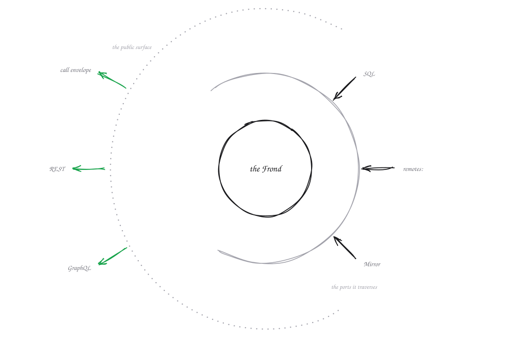
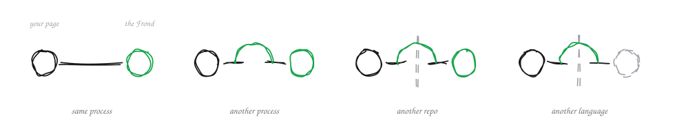

<div align="center">

# 🌿 Fougere

**Write the domain. Everything else is a projection of it — including the wire.**

You declare the business object and you judge its transitions. From that, one class is
the TypeScript type, the validator, the SQL table, the form contract and the API
surface. And because the declaration is JSON on the wire, the domain can move to its
own process — or to another language — while the code calling it does not change.

**Alpha on npm** — `npm create fougere` — [what works today](#where-it-stands).
**[Read the docs →](https://chok.github.io/fougere/)**

[](https://github.com/chok/fougere/actions/workflows/ci.yml)
[](https://www.npmjs.com/package/@fougere/schema)
[](#where-it-stands)

</div>

---

## Your domain, declared once

This is a blog post. Not a DTO, not a table, not a validation schema — the business
object itself, said once, in the words of the business. It is the real file behind
[this project's own site](./site/fronds/blog), not a sketch.

```ts
// fronds/blog/entities/Post.ts
export default class Post extends entity({
  id: primary(),
  slug: text({ min: 1, max: 80 }),
  title: text({ min: 1, max: 160 }),
  summary: optional(text({ max: 300 })),
  body: optional(text()),
  // Server-owned: stamped from the session at create, never client-written.
  authorId: readOnly(text()),
  authorName: readOnly(optional(text())),
  createdAt: created(),
  // Server-owned pair: born draft, flipped by the publish OPERATION —
  // never by a client writing the field (readOnly closes the inbound door).
  status: readOnly(oneOf('draft', 'published', { default: 'draft' })),
  publishedAt: readOnly(optional(date())),
}) {}
```

A field says **four** things, and each one is read by someone different:

| axis | what it states | who reads it |
| --- | --- | --- |
| `shape` | `text({ max: 160 })` — and it *is* JSON Schema | the validator, in the browser and at the façade |
| `role` | `primary()`, `ref(User)` | the table, the relations, the GraphQL type |
| `lifecycle` | *who* writes this value and *when* — `created()`, `updated()` | the ORM, which stamps it |
| `boundary` | which direction it may cross — `readOnly`, `writeOnly` | the door, which drops it from `inputFields` |

`readOnly(status)` is not a note about intent. It removes `status` from what a client
may ever send, so publishing cannot be a field write — it has to be an operation.

## The rules are the domain too

The interesting part is never `update()`. It is the transition — and a transition has
a judge. That judge is the code you are actually paid to write, and it is the only
code on this page Fougere does not derive.

```ts
// fronds/blog/handlers/PostHandler.ts
export class PostDraft extends Post.pick('slug', 'title', 'summary', 'body') {}
export class PostCard  extends Post.pick('id', 'slug', 'title', 'summary', 'authorName', 'publishedAt') {}

export default class PostHandler extends Crud(Post, { list: PostCard }) {
  /** Judge: the author, a draft, a body worth publishing. Realize: stamp the pair. */
  async publish(id: string, user: User | null): Promise<Post> {
    const author = requireUser(user, 'publish');
    const post = await requireOwn(this.orm, id, author, 'publish');

    if (post.status === 'published') {
      throw new FougereError({
        code: ErrorCode.CONFLICT, message: 'Already published',
        entity: 'post', operation: 'publish',
      });
    }
    if (!post.body?.trim()) {
      throw new FougereError({
        code: ErrorCode.CONFLICT, message: 'Cannot publish an empty draft',
        entity: 'post', operation: 'publish',
      });
    }

    return this.orm.update(id, { status: 'published', publishedAt: new Date() });
  }
}
```

Three things carry weight here, and none of them are wiring:

- **`user: User | null` is the injection.** The signature is matched *by type* against
  the collector that resolves the session — no decorator, no container lookup to write.
- **`PostDraft` and `PostCard` are `Post.pick(…)`.** One class per business object,
  several derived contracts: what a client may propose, what a list emits. The judge
  still reads every field of the row.
- **`requireUser` and `requireOwn` are module-level functions**, deliberately. Only
  *public class methods* become operations, so a helper outside the class cannot turn
  into a callable op by accident.

That is the blog behind this site, trimmed to `publish`. The whole Frond — the entity,
the handler with its six other operations, the collector — is three files and 153 lines
under [`site/fronds/blog/`](./site/fronds/blog).

## What you did not write

<picture>
  <source media="(prefers-color-scheme: dark)" srcset="./docs/img/core-and-arcs.dark.svg">
  
</picture>

Those three files are the domain and nothing else. Everything below was derived from
them, and none of it is yours to keep in sync:

| | |
| --- | --- |
| **Validation** | the same judge in the browser and at the façade — unknown keys refused |
| **Storage** | the SQL table and additive schema sync (create tables/add columns) |
| **Forms** | `useFormFor(Post)` — fields, rules, per-field error mapping |
| **API surface** | `post.list`, `post.create`, `post.publish`… |
| **GraphQL** | `type Post { … }`, its inputs, and `publish` as a mutation |
| **REST** | the routes, from the same operations |
| **Types** | the class *is* the type |

No codegen step, no `dist/generated`, no watcher to keep running. The declaration is
the artefact.

That holds because the declaration is a TypeScript file you `import`. Prisma writes
`.prisma`, GraphQL writes `.graphql`, Ash writes Elixir — none of which a TypeScript
consumer can import, so a translation step is not their weakness, it is the only way
in. The one case where the same is true here is a frond whose code you do not have:
another repo, another language. Then `fougere sync` fetches its card over
`rpc.discover` and writes a file — an address is all it needs, never the source.
And even that is optional: `reconstruct(card)` rebuilds a working judge in memory
with nothing on disk (`demos/rust-frond/consumer.ts`). The file exists so the
*compiler* has a type, not so the rule can travel.

Held the usual way, that list is four files you write, then re-read every time the
shape moves:

```ts
// schemas/post.ts — the shape, first time
export const postSchema = z.object({ title: z.string().min(1).max(160) });

// server/db/schema.ts — the shape, again
export const posts = sqliteTable('posts', { title: text('title').notNull() });

// server/api/posts.post.ts — wired by hand
const body = postSchema.parse(await readBody(event));

// app/components/PostForm.vue — the rules, again
const rules = { title: [required, maxLength(160)] };
```

The bug is never in one of those files. It is in the day two of them stopped agreeing.

## One entity, in the framework you already have

None of the above asks you to adopt the framework. An entity is a
[Standard Schema](https://standardschema.dev/), so it is accepted wherever one is —
tRPC, Hono, TanStack Form today, and the server frameworks adopting the spec as their
route-level validation.

```ts
export class PostDraft extends Post.pick('title', 'summary', 'body') {}

PostDraft['~standard'];                          // { version: 1, vendor: 'fougere', validate }
PostDraft['~standard'].validate({ title: '' });  // { issues: [{ message, path: [{ key: 'title' }] }] }
```

That is one `npm i @fougere/schema` and no adapter package — the interface is a static
getter on the class, and derivations (`pick`, `omit`, `partial`, `extend`) carry it too.

Be clear about what crosses: **the judge, and only the judge**. Standard Schema is
`validate(value) → value | issues`, so the other three axes stay home — no table, no
GraphQL type, no form contract. The entity is the piece that fits through the hole; the
reason to come back for the rest is `getFields()`.

## The domain travels

<picture>
  <source media="(prefers-color-scheme: dark)" srcset="./docs/img/gradient.dark.svg">
  
</picture>

A **Frond** is a domain — its entities, its handlers, its collectors, its seeds.
Where it runs is one line of configuration, and it is the only line that changes.

```ts
// fougere.config.ts — the entire topology statement
export default defineFougere({
  db: { dialect: 'sqlite', path: '.data/site.db' },
  remotes: { blog: 'http://blog-node:4100' },  // delete this line → same app, in-process
});
```

```ts
// app/pages/blog/index.vue — identical either way, byte for byte
import Post from '@frond/blog/entities/Post';

const { items } = await useQuery(Post, 'list');
const publish = useCommand(Post, 'publish');

await publish.execute({ params: { id } });   // every mounted query on Post revalidates
```

There is no RPC without travel: in-process, a call is direct memory execution, not a
loopback request. Split, the host going down is a typed `503` in your pages, not a
stack trace — and when it comes back, the pages recover.

### The far side does not have to be TypeScript

A Frond honours two contracts and both are JSON: **the wire** (JSON-RPC 2.0 at
`POST /_fougere/call`) and **the map** (`rpc.discover`, which returns what it hosts,
schemas included). Neither mentions TypeScript.

[`demos/rust-frond`](./demos/rust-frond) is a `telemetry` domain written in Rust. There
is no `class Sensor extends entity({…})` anywhere in it — the declaration lives in
`src/main.rs`. The TypeScript consumer asks for the map, rebuilds a **live** schema from
it, and refuses a bad payload before any network happens:

```
✗ couleur  — Unknown field
✗ celsius  — 250 is greater than 80.
✗ checksum — Read-only
```

Those three refusals are the four axes crossing a language boundary: `shape` *is* the
JSON Schema at the top level of the field, and `role`, `lifecycle` and `boundary` ride
under `x-fougere`. The **rules** travel, not just the types — and no line of TypeScript
declared any of them.

What does not travel is the static type: the map rebuilds a full runtime schema, but
its literal keys are lost, so `sensor.label` comes back untyped. A map → `.d.ts`
projection would close that, and does not exist.

### And some things leave without being called

Every call above names **one** recipient. An emission names a **subject**, and the number
of readers is not the emitter's business:

```ts
constructor(private published: Emit<PostPublished>) {}      // in the blog handler
async reindex(fact: Fact<PostPublished>): Promise<void> {}   // in the search handler
```

There is no topic, no subscribe call, no listener list. **Accepting a `Fact<T>` is the
subscription** — the scan reads the signature, exactly as it reads `EntityOrm<Post>`. A
subscriber keeps its own judge, its own binding and its own middlewares, because a fact is
routed to the door that already exists rather than to a channel.

It is a resolver, so it holds nothing: no log, no cursor, no retry. That is deliberate, and
[`demos/emit-multirepo`](./demos/emit-multirepo) shows the ~80-line broker that supplies all
three when you need them. [`demos/emit-fleet`](./demos/emit-fleet) is the fan-out — one hub,
many nodes, facts in both directions.

[Read about facts →](https://chok.github.io/fougere/docs/business/facts)

## Try it

```bash
npm create fougere shop --frond blog --app nuxt
cd shop && pnpm install && pnpm dev
```

Or read the source of everything below, which is where the claims are proven:

```bash
git clone git@github.com:chok/fougere.git && cd fougere
pnpm install
pnpm -r build
```

> If `better-sqlite3` fails to load, run `npx prebuild-install` in its pnpm directory.

**The site — the fullest thing to read.** Its blog is a real Frond: a judged
draft→publish, author-only edits, the form contract and the query primitive. The docs
are the reference, and the whole thing is the proof of the claim.

```bash
pnpm -C site dev                   # :3000
```

**The gradient — two terminals, one line of config.**

```bash
pnpm -C demos/nuxt-blog dev:blog   # the blog Frond alone, in its own process (:4100)
pnpm -C demos/nuxt-blog dev        # the Nuxt app that consumes it (:3000)
```

Kill the first one and reload: a typed `503` in the pages. Start it again: they
recover. Then comment out `remotes:` in `demos/nuxt-blog/fougere.config.ts` and run
only the second command — same app, same code, one process.

**The Rust Frond — the shortest proof that the contract is not TypeScript.**

```bash
cd demos/rust-frond
cargo run --release     # the Rust frond, :4200
npx tsx consumer.ts     # another terminal — a TS consumer that knows none of its entities
```

To start your own app, `fougere new` composes a pnpm workspace — from npm by default,
or linked to this checkout with `--local`. See
[the CLI docs](https://chok.github.io/fougere/docs/cli).

## Where it stands

**Alpha** — `0.1.0-alpha.0`, published under the `alpha` tag. The version is the whole
promise: the surface can still move. What follows has been seen running, not planned:

- the five client primitives (`useQuery`/`useCommand`, `useFormFor`, `useCurrentUser`,
  `invoke`) are the only path — there is no escape hatch to maintain;
- a judged business feature (draft→publish) exercised in a browser;
- the split lived daily: host killed → typed `503` in the pages, restarted → recovery;
- identical user code in-process and split, all the way through a production build;
- [this site](./site) — landing page, docs and blog — is a Fougere app.

Known limits, stated plainly, because you'd find them anyway:

- **storage** is SQLite with additive auto-DDL today; renames, removals and type changes
  require an explicit migration. The other dialects exist in `schema-sql` but are not
  the walked path;
- **a computed field costs one read per row** — name a view for the operation
  (`Crud(Post, { list: PostCard })`) or batch in the handler;
- **a split link is loopback only**: the receiving side trusts the identity it is handed,
  so `serve()` refuses any other bind;
- the full list lives in [`CLAUDE.md`](./CLAUDE.md#known-issues), kept honest rather
  than short.

## The repo

| | |
| --- | --- |
| [`packages/schema`](./packages/schema) | `entity()`, the field vocabulary, the four axes, validation |
| [`packages/adapter/`](./packages/adapter) | the projections — [`sql`](./packages/adapter/sql) Kysely tables, [`graphql`](./packages/adapter/graphql) Pothos types, [`rest`](./packages/adapter/rest) routes |
| [`packages/core`](./packages/core) | the scanner, the call contract, `Crud`, bootstrap |
| [`packages/transport`](./packages/transport) | the JSON-RPC 2.0 wire — it moves the call, never reshapes it |
| [`packages/app/`](./packages/app) | the client primitives ([`shared`](./packages/app/shared)) and one binding per host — nuxt, next, react, svelte, vite |
| [`packages/defaults`](./packages/defaults) · [`http`](./packages/http) | the conventional boot; the `HttpRouter` port and its adapters |
| [`packages/auth/better`](./packages/auth/better) · [`container`](./packages/container) · [`cli`](./packages/cli) | auth translation, DI, the scaffolder |
| [`packages/entry/`](./packages/entry) | `fougere` and `create-fougere` — the names you type, they hold no code |
| [`site/`](./site) | the site of Fougere, built with Fougere |
| [`demos/`](./demos) | `nuxt-blog` is the flagship; the others isolate one idea each |

## Docs

**[chok.github.io/fougere](https://chok.github.io/fougere/)** — the site, prerendered
on every push. English and French. The source is [`site/content/`](./site/content), and
`pnpm -C site dev` serves it live, blog included.

- [Philosophy](https://chok.github.io/fougere/docs/concepts/philosophy) — the model, and why it is shaped this way
- [Entities and the four axes](https://chok.github.io/fougere/docs/schema/entities) — the field vocabulary
- [The gradient](https://chok.github.io/fougere/docs/infra/gradient) — in-process, split, and what stays identical
- [Adopting it in an existing app](https://chok.github.io/fougere/docs/existing-app) — feature by feature, honestly priced

---

<div align="center">
<sub>MIT · built by <a href="https://github.com/chok">chok</a></sub>
</div>
