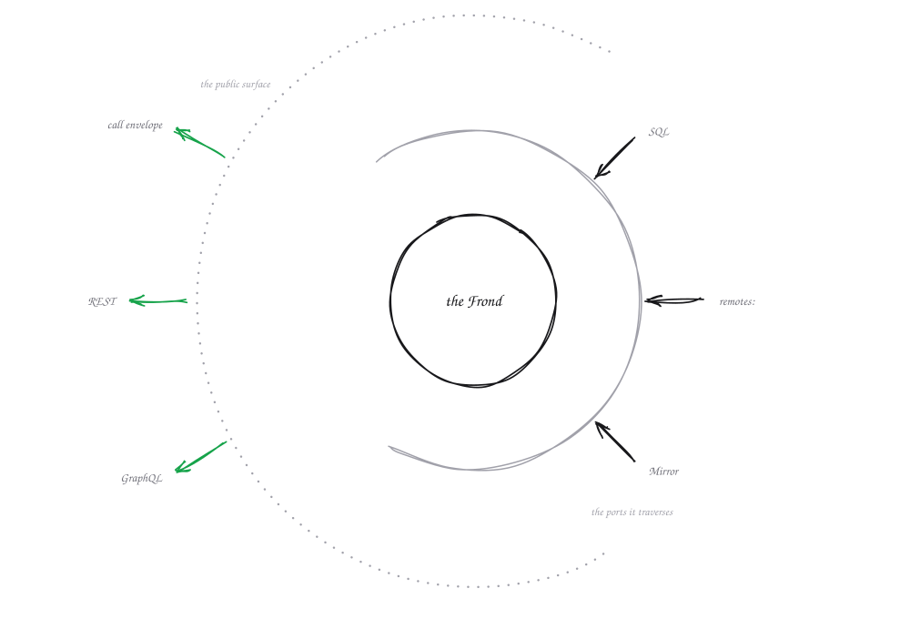
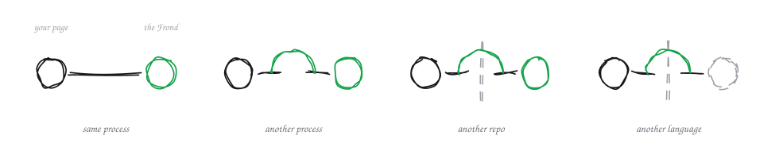

<div align="center">

# 🌿 Fougere

**Fougere is focused on your business only. Create it.**
**Decide later which infrastructure topology you want**
**And which technology you want in front of it (GraphQL, REST, ...)**

With one entity class, everything is derived (Validation, Table, API,...).
No DTOs to write, nothing to keep in sync. It's the same class!

[](https://github.com/chok/fougere/actions/workflows/ci.yml)
[](https://www.npmjs.com/package/@fougere/schema)
[](#alpha-today)

**[Documentation →](https://fougere.dev/)**

</div>

---

<table>
<tr>
<th>Entity</th>
<th>Repository</th>
<th>Handler</th>
</tr>
<tr>
<td valign="top">

```ts
// entities/Post.ts
export default class Post extends entity({
  id: primary(),
  title: text({ min: 1, max: 200 }),
  body: text(),
  createdAt: created(),
  status: readOnly(oneOf('draft', 'published', { default: 'draft' })),
}) {}
```

</td>
<td valign="top">

```ts
// repositories/PostRepository.ts
export class PostCard extends Post.pick('id', 'title', 'status') {}

export default class PostRepository extends Repository(Post) {
  published(): Promise<PostCard[]> {
    return this.output(PostCard).findAllBy({ status: 'published' });
  }
}
```

</td>
<td valign="top">

```ts
// handlers/PostHandler.ts
export default class PostHandler extends Crud(Post) {
  constructor(private posts: PostRepository) {
    super(posts);
  }

  async publish(id: string): Promise<Post> {
    const post = await super.findById(id);
    if (!post) {
      throw new FougereError({
        code: ErrorCode.NOT_FOUND,
        message: `Post '${id}' not found`,
      });
    }

    return super.update(id, { status: 'published' });
  }

  listPublished(): Promise<PostCard[]> {
    return this.posts.published();
  }
}
```

</td>
</tr>
<tr>
<th colspan="3">Nuxt page</th>
</tr>
<tr>
<td colspan="3">

```vue
<!-- app/pages/posts.vue -->
<script setup lang="ts">
import { post } from '@fronds/facade';

const { items } = await useQuery(post, 'list');
const publish = useCommand(post, 'publish');
</script>

<template>
  <ul>
    <li v-for="row in items" :key="row.id">
      {{ row.title }} — {{ row.status }}
      <button
        v-if="row.status === 'draft'"
        @click="publish.execute({ params: { id: row.id } })"
      >
        Publish
      </button>
    </li>
  </ul>
</template>
```

</td>
</tr>
</table>

That's all! All data coming to your handler are validated throw your schema definition and the output is defined to JSON RPC by default but you can enable REST or Graphql.

> [!TIP]
> If you need full controll on routes for example, you can specify it in config or throw extension.

## Quick start

With pnpm, a version published too recently is held back by its `minimum-release-age`. To try the
latest one right away:

```bash
pnpm --config.minimum-release-age=0 create fougere
```

You now have a running app: the table created, the form contract, the REST and GraphQL
surfaces, and pages calling operations through `useQuery` / `useCommand`. Nothing above
was generated into a file you have to keep.

## Or adopt nothing

An entity is a [Standard Schema](https://standardschema.dev/), so it is accepted wherever
one is — tRPC, Hono, TanStack Form, and the server frameworks adopting the spec for
route-level validation. One `npm i @fougere/schema`, no adapter package, nothing else of
Fougere in your app.

```ts
export class PostDraft extends Post.pick('title', 'summary', 'body') {}

PostDraft['~standard'].validate({ title: '' }); // { issues: [{ message, path: [{ key: 'title' }] }] }
```

Be clear about what crosses: **the validator, and only the validator**. The other three axes stay
home — no table, no GraphQL type, no form contract. The entity is the piece that fits
through the hole; the reason to come back for the rest is `getFields()`.

## What derives from it

<picture>
  <source media="(prefers-color-scheme: dark)" srcset="./docs/img/core-and-arcs.dark.svg">
  
</picture>

|                    |                                                                            |
| ------------------ | -------------------------------------------------------------------------- |
| **Validation**     | the same validator in the browser and at the façade — unknown keys refused |
| **Storage**        | the SQL table and additive schema sync                                     |
| **Forms**          | `useFormFor(Post)` — fields, rules, per-field error mapping                |
| **API surface**    | `post.list`, `post.create`, `post.publish`…                                |
| **GraphQL · REST** | the types, the inputs, the routes — from the same operations               |
| **Types**          | the class _is_ the type                                                    |

No codegen step, no `dist/generated`, no watcher. The declaration is the artefact.

## What stays yours

The interesting part is never `update()`. It is the transition, and a transition has a
validator — the only code on this page Fougere does not derive.

```ts
// fronds/blog/handlers/PostHandler.ts
export class PostCard extends Post.pick(
  'id',
  'slug',
  'title',
  'summary',
  'authorName',
  'publishedAt',
) {}

export default class PostHandler extends Crud(Post, { list: PostCard }) {
  constructor(private posts: PostRepository) {
    super(posts);
  }

  /** Validate: the author, a draft, a body worth publishing. Realize: stamp the pair. */
  async publish(id: string, user?: User): Promise<Post> {
    const author = requireUser(user, 'publish');
    const post = await requireOwn(this.posts, id, author, 'publish');
    if (post.status === 'published') {
      throw new FougereError({ code: ErrorCode.CONFLICT, message: 'Already published' });
    }
    return this.posts.update(id, { status: 'published', publishedAt: new Date() });
  }
}
```

`user?: User` is the injection: the signature is matched **by type** against the
collector that resolves the session. No decorator, no container lookup to write.

## The domain travels

<picture>
  <source media="(prefers-color-scheme: dark)" srcset="./docs/img/gradient.dark.svg">
  
</picture>

A **Frond** is a domain — its entities, handlers, collectors, seeds. Where it runs is one
line, and it is the only line that changes:

```ts
// fougere.config.ts
remotes: { blog: 'http://blog-node:4100' },  // delete this line → same app, in-process
```

In-process, a call is direct memory execution, not a loopback request. Split, a host going
down is a typed `503` in your pages, and they recover when it returns. The far side does
not have to be TypeScript: [`demos/rust-frond`](./demos/rust-frond) is a domain written in
Rust whose rules — not just its types — are enforced by the TypeScript validator.

## Alpha today

Published on npm under the `alpha` tag. The version is the whole promise: the surface can
still move. Seen running, not planned — a validated draft→publish exercised in a
browser, the split lived daily, identical user code either side through a production
build, and [this site](./site) is itself a Fougere app.

Known limits, because you would find them anyway: the boot never writes a schema —
`fougere migrate` applies what `fougere freeze` recorded — tables, columns, renames, drops — and a type
change needs a migration you write; a computed field costs
one read per row unless you name a view. A split receiver binds to loopback by default;
widening it requires signed envelopes, or an explicit `allowUnsigned` when an upstream mesh
already authenticated the caller. The full list is in
[`CLAUDE.md`](./CLAUDE.md#known-issues), kept honest rather than short.

## Learn more

- [Getting started](https://fougere.dev/docs/getting-started)
- [Philosophy](https://fougere.dev/docs/concepts/philosophy)
- [Entities and the four axes](https://fougere.dev/docs/schema/entities)
- [The gradient](https://fougere.dev/docs/infra/gradient)
- [Adopting it in an existing app](https://fougere.dev/docs/existing-app)

[`demos/`](./demos) isolates one idea per project; `nuxt-blog` is the flagship.

---

<div align="center">
<sub>MIT · built by <a href="https://github.com/chok">chok</a></sub>
</div>
