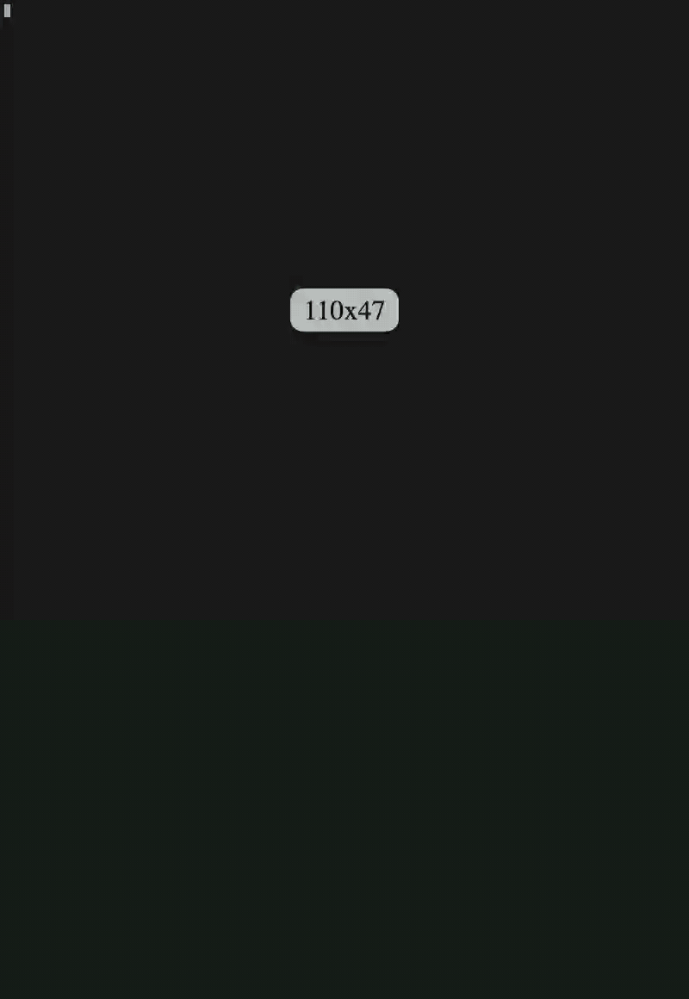
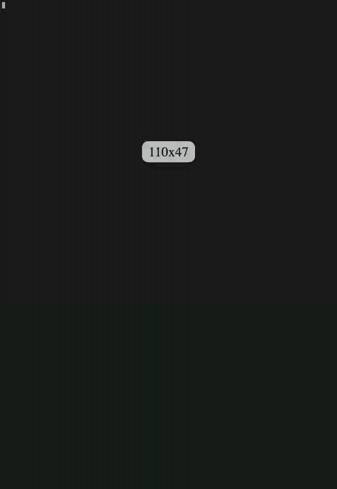

<div align="center">

# 🌿 Fougere

**Fougere is focused on your business only. Build it.**<br/>
**Decide later which infrastructure topology you want,**<br/>
**And which technology you want in front of it (GraphQL, REST…).**

With one entity class, everything is derived (validation, table, API…).<br/>
No DTOs to write. It's the same class derived for your needs!<br/>
You split your app into [fronds](https://fougere.dev/docs/concepts/frond), one per business area, and each one can run inside it or on its own.

[](https://github.com/chok/fougere/actions/workflows/ci.yml)
[](https://www.npmjs.com/package/@fougere/schema)
[](./KNOWN_ISSUES.md)

**[Documentation →](https://fougere.dev/)**

</div>

---

> [!IMPORTANT]
> Fougere is in alpha, so use it with caution: APIs and conventions may still change.<br/>
> There are also many [known issues](./KNOWN_ISSUES.md).

---

A picture (or an animation!) is worth a thousand words!

So first, **add a field** to an entity and everything derives from it (form, validation, APIs, SQL):

<p align="center"></p>

Secondly, **move a frond to its own process.** One line of config, and the code stays the same.

<p align="center"></p>

Everything your handler receives is validated against your schema, and it is served over JSON-RPC by default. You can enable REST or GraphQL as well.

> [!TIP]
> If you need full control over routes, for example, you can set them in config.

## Quick start

For now, only pnpm is fully supported. Fougere changes quickly, so to try the latest release:

```bash
pnpm --config.minimum-release-age=0 create fougere
```

With no arguments, it walks you through creating a new app in an interactive terminal UI.

> [!NOTE]
> It runs `fougere new` from the [CLI](https://fougere.dev/docs/cli).

→ [Getting started](https://fougere.dev/docs/getting-started)

## Philosophy

Fougere is heavily inspired by DDD and hexagonal architecture, but doesn't follow them strictly. Think of Fougere as a core around your business logic. Primary adapters, like REST or GraphQL, can be attached to your business logic, but Fougere doesn't know about them. In the same way, the core handles storage without knowing what it is. Implementations are provided for these adapters, but you can write your own to support any kind of input or output.

The one primitive to know is the Frond, the fractal leaf of a fern (_fougère_ in French). It is like a bounded context: you can't call another frond's services directly, only the public code its handlers expose. In return, calling that code is made simple, with several ways to reach a frond's code.

→ [Philosophy](https://fougere.dev/docs/concepts/philosophy)

## Features

- **App**: it's not a standalone framework. You can embed it in the one you already use (Nuxt, Next…), or serve a frond on its own with an existing HTTP framework. Fougere is not an HTTP framework at heart.
- **Schema**: it is the center. Validation, forms, SQL tables, REST and GraphQL are all derived from it.
- **Errors**: they are typed. A frontend knows exactly which errors each operation can return, without declaring them.
- **Events**: no listener to register. Ask for an `Emit<PostPublished>` to announce a fact, and accept a `Fact<PostPublished>` to subscribe to it. Across processes, it goes over HTTP by default, or through a broker you plug in (Kafka, NATS…).
- **Migrations**: `fougere freeze` saves each version of your schema as extended JSON Schema. Migrations are deduced from that chain of versions: no SQL to write, and the whole history of changes is kept.
- **Deployment**: fronds can run together inside your app, or each in its own process. Moving one is a single line of config.
- **Observability**: you can observe every process, because the framework owns the input and output of every frond, even when they run in separate processes. One trace follows a call across all of them (optional).
- **Convention over configuration**: Fougere relies on conventions, and you can override them. An optional compiler reads your code and derives the configuration from it, but you can also declare it by hand: the compiler isn't needed to run your app.
- **Standards**: a frond can be written in any language. Fougere follows standards (extended JSON Schema, JSON-RPC, Standard Schema), and there is a Rust frond in the demos. SDKs for other languages may follow.
- **CLI**: your operations are available from the command line, with nothing to write. It's derived too.

## Learn more

- [Schema](https://fougere.dev/docs/schema/entities)
- [The gradient](https://fougere.dev/docs/infra/gradient)
- [`Demos`](./demos)
